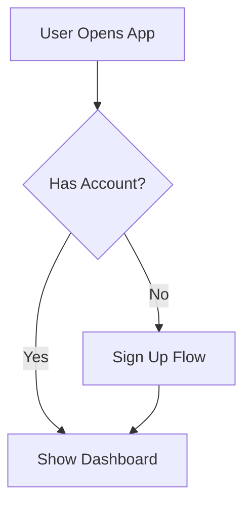
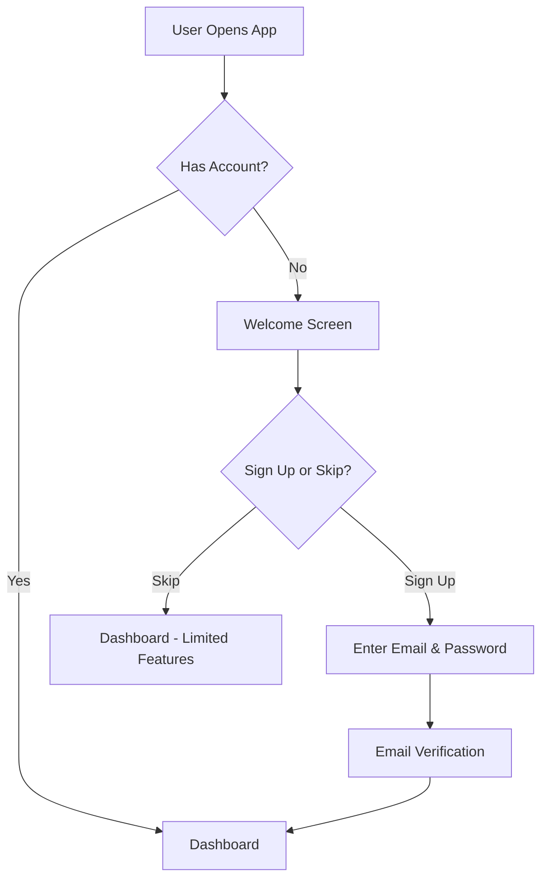

# Day 5: Real UX/PM Workflows - Part 1

## Learning Objectives

By the end of this session, you will:
1. Create design documentation efficiently with Claude Code
2. Generate user flow diagrams using Mermaid
3. Synthesize meeting notes into structured documents
4. Organize and analyze research findings
5. Have practical workflows you can use immediately at work

## Recap: Ready for Real Work

**Days 1-2:** You learned the basics (installation, CLI)
**Days 3-4:** You learned to use Claude Code and organize projects
**Day 5 (Today):** You'll apply everything to real UX/PM tasks!

## Workflow 1: Design Documentation

### The Challenge

Creating design specs is time-consuming. You need:
- Consistent structure
- Clear sections
- Proper formatting
- Tables, lists, and diagrams

**Manual process:** 30-60 minutes per spec

**With Claude Code:** 5-10 minutes, then customize

### The Claude Code Workflow

**Step 1: Start with requirements**

Create a quick notes file with your thoughts:
```bash
# In your project folder
touch design-requirements.txt
open design-requirements.txt
```

Add your rough notes:
```
New user onboarding flow
- Need to collect: name, email, preferences
- 3-4 screens max
- Should feel quick and easy
- Include skip option
- Explain value proposition
```

**Step 2: Ask Claude to structure it**

```bash
claude
```

```
Read design-requirements.txt and create a complete design specification document called onboarding-flow-spec.md with these sections:

# User Onboarding Flow - Design Specification

## Overview
- Feature name
- Purpose
- User value proposition

## User Flow
Step-by-step user journey with decision points

## Screens Required
List each screen with purpose

## Components
UI components needed for implementation

## Data Collection
What information we collect and why

## Interactions
- Tap targets
- Transitions
- Animations
- Micro-interactions

## Accessibility
- Screen reader support
- Keyboard navigation
- Color contrast
- Touch target sizes (minimum 44x44px)

## Edge Cases
- What if user skips?
- What if validation fails?
- What if network error?

## Success Metrics
How we'll measure if this works

## Implementation Notes
Technical considerations for developers

Use proper markdown formatting. Add placeholders where I need to fill in details. Create tables where appropriate.
```

**Step 3: Review and customize**

Claude creates a complete, structured spec. You fill in the specific details.

**Result:** Professional design spec in 5 minutes instead of 30.

### Real Example Output

Claude would create something like:

```markdown
# User Onboarding Flow - Design Specification

## Overview

**Feature:** User Onboarding Flow
**Purpose:** Guide new users through account setup and preference collection
**Value Proposition:** Get personalized experience from day one

## User Flow

1. **Welcome Screen**
   - User lands on welcome screen
   - Sees value proposition
   - Decides: Continue or Skip

2. **Personal Info (Screen 1)**
   - Collects: Name, Email
   - Validation: Email format check
   - Next → Preferences

3. **Preferences (Screen 2)**
   - Collects: Interests, Categories
   - Multiple selection allowed
   - Next → Confirmation

4. **Confirmation (Screen 3)**
   - Summary of choices
   - Option to edit
   - Complete → Dashboard

## Screens Required

| Screen | Purpose | Can Skip? |
|--------|---------|-----------|
| Welcome | Introduce value prop | Yes |
| Personal Info | Collect basic data | No |
| Preferences | Personalization | Yes |
| Confirmation | Review choices | No |

## Components

- **Input Field**: Name, Email (with validation)
- **Multi-Select Chips**: For preference selection
- **Primary CTA Button**: "Continue", "Complete"
- **Secondary CTA Button**: "Skip", "Edit"
- **Progress Indicator**: Show 1 of 3, 2 of 3, etc.

[... continues with more sections]
```

## Workflow 2: User Flow Diagrams (Mermaid)

### The Challenge

Creating flow diagrams usually requires:
- Design tools (Figma, Lucidchart)
- Dragging and connecting boxes
- Exporting and updating

**With Claude Code:** Generate diagrams as code!

### Mermaid: Diagrams as Text

Mermaid is a syntax that creates diagrams from text. It renders in GitHub, many documentation tools, and can be converted to images.

**Example Mermaid code:**


This creates an actual flowchart!

### The Claude Code Workflow

**Step 1: Describe the flow**

```bash
claude
```

```
Create a Mermaid flowchart for a user onboarding flow with these steps:

1. User opens app
2. Check if has account
   - If yes → Go to dashboard
   - If no → Show welcome screen
3. Welcome screen
   - User can sign up or skip
4. If sign up → Collect email and password
5. If skip → Go to dashboard (limited features)
6. After sign up → Email verification
7. After verification → Go to dashboard

Save this as user-flow.md with the Mermaid diagram and a written explanation below it.
```

**Step 2: Claude generates the diagram**

Claude creates:

```markdown
# User Onboarding Flow

## Flow Diagram



## Flow Description

**Entry Point:** User opens the application

**Decision Point 1:** Check if user has existing account
- Existing users proceed directly to dashboard
- New users see welcome screen

**Decision Point 2:** User chooses sign up or skip
- Sign up: Full onboarding with email verification
- Skip: Access to limited features, prompted later

**Email Verification:** Required for security and communication

**Final State:** User reaches dashboard (full or limited access)

## Edge Cases
- Network failure during verification
- User closes app during sign up
- Invalid email format
```

**Step 3: View the diagram**

On GitHub or in tools that support Mermaid, this renders as an actual flowchart!

### Common Flow Types

**User Flow:**
```
Create a Mermaid flowchart showing the complete user journey for [feature]
```

**Decision Tree:**
```
Create a Mermaid flowchart showing all decision points in the [process] with yes/no branches
```

**System Flow:**
```
Create a Mermaid sequence diagram showing how [feature] works across frontend, backend, and database
```

## Workflow 3: Meeting Notes Synthesis

### The Challenge

After meetings, you have:
- Messy notes
- Action items buried in text
- Decisions not clearly marked
- Hard to find key points later

### The Claude Code Workflow

**Step 1: Take rough notes during meeting**

Just jot everything down:

```
product team sync - jan 15 2026

talked about q1 roadmap
sarah mentioned user onboarding needs work - too many dropoffs at step 3
mike wants to prioritize mobile app updates
discussed: should we redesign onboarding or just fix step 3?
DECISION: fix step 3 first then full redesign in q2
ACTION: sarah to create mockups by jan 20
ACTION: mike to get analytics breakdown by jan 17
also talked about hiring needs
need another PM maybe in q2
budget review happening next week
```

**Step 2: Ask Claude to structure it**

```bash
claude
```

```
Read meeting-notes-raw.txt and create a structured meeting notes document called meeting-notes-2026-01-15.md with:

# Product Team Sync - January 15, 2026

## Attendees
[Extract from notes]

## Discussion Topics
Organized by topic with key points

## Decisions Made
Clear list of decisions

## Action Items
Table with: Task | Owner | Due Date | Status

## Follow-up Items
Things to revisit

## Next Meeting
When and what to cover

Format professionally with markdown. Make action items a clear table.
```

**Step 3: Claude creates structured notes**

Result:

```markdown
# Product Team Sync - January 15, 2026

## Attendees
- Sarah (UX Lead)
- Mike (PM)
- [Your name]

## Discussion Topics

### Q1 Roadmap Priorities
- User onboarding improvements identified as priority
- Mobile app updates also high priority
- Timing and sequencing discussed

### User Onboarding Issues
- **Problem:** High drop-off rate at Step 3 of onboarding
- **Current state:** Significant user abandonment
- **Options considered:**
  1. Quick fix to Step 3
  2. Complete onboarding redesign
  3. Hybrid approach

### Team Growth
- Potential need for additional PM in Q2
- Budget review scheduled for next week
- Hiring timeline TBD

## Decisions Made

1. ✅ **Fix Step 3 first, full redesign in Q2**
   - Rationale: Quick win now, comprehensive solution later
   - Timeline: Step 3 fix in Jan, redesign planning starts Q2

## Action Items

| Task | Owner | Due Date | Status |
|------|-------|----------|--------|
| Create mockups for Step 3 improvements | Sarah | Jan 20, 2026 | 🔄 In Progress |
| Get analytics breakdown for onboarding drop-offs | Mike | Jan 17, 2026 | ⏳ Pending |
| Prepare for budget review | Team | Jan 22, 2026 | ⏳ Pending |

## Follow-up Items

- Review analytics before Step 3 redesign kickoff
- Discuss PM hiring timeline after budget review
- Monitor Step 3 improvements post-launch

## Next Meeting

**Date:** January 22, 2026
**Focus:** Budget review and Step 3 mockup review
```

**Huge time saver!** Transforms messy notes into shareable document in seconds.

## Workflow 4: Research Synthesis

### The Challenge

After conducting user research:
- 5-10 interview transcripts
- Pages of observations
- User quotes scattered everywhere
- Need to identify themes
- Extract insights
- Create recommendations

**Manual process:** 2-4 hours
**With Claude Code:** 30 minutes

### The Claude Code Workflow

**Step 1: Organize raw data**

```
research/
├── interviews/
│   ├── participant-01.md
│   ├── participant-02.md
│   ├── participant-03.md
│   ├── participant-04.md
│   └── participant-05.md
└── synthesis/
```

**Step 2: Ask Claude to find patterns**

```bash
claude
```

```
Read all files in research/interviews/ and identify:

1. Common themes (group similar points)
2. Frequency of mentions (how often each theme came up)
3. Compelling user quotes for each theme
4. Patterns across participants
5. Outliers or unique insights

Create a document called research/synthesis/themes-analysis.md with:
- Each theme as a header
- Description of the theme
- How many participants mentioned it
- Representative quotes
- Implications for design

Use a table to summarize themes with frequency.
```

**Step 3: Claude analyzes and synthesizes**

Result:

```markdown
# Research Synthesis - Key Themes

## Overview
**Participants:** 5 interviews
**Date Range:** Jan 10-15, 2026
**Focus:** Mobile banking app usage

## Themes Summary

| Theme | Frequency | Severity | Priority |
|-------|-----------|----------|----------|
| Security concerns | 5/5 (100%) | High | P0 |
| Slow transaction speed | 4/5 (80%) | Medium | P1 |
| Confusing navigation | 3/5 (60%) | Medium | P1 |
| Lack of spending insights | 3/5 (60%) | Low | P2 |

## Theme 1: Security Concerns

**Description:** All participants expressed anxiety about mobile banking security. Concerns ranged from login security to transaction safety.

**Frequency:** 5 out of 5 participants (100%)

**Key Quotes:**
> "I always worry if my password is secure enough" - Participant 03
> "I wish there was biometric login" - Participant 01
> "Sometimes I don't do transactions on my phone because I don't trust it" - Participant 05

**Implications:**
- Security features should be prominent, not hidden
- Consider adding biometric authentication
- Show security indicators during sensitive actions
- Educate users on existing security features

[... continues for each theme]

## Patterns Identified

1. **Trust Gap:** Users want mobile banking convenience but don't fully trust it
2. **Speed Expectations:** Mobile should be faster than web, but currently isn't
3. **Navigation Confusion:** Users get lost trying to find features

## Recommendations

### High Priority (P0)
1. Add biometric authentication
2. Improve visible security indicators
3. Simplify navigation architecture

### Medium Priority (P1)
4. Optimize transaction speed
5. Add spending insights dashboard

[... continues]
```

**Step 4: Create executive summary**

```
Based on research/synthesis/themes-analysis.md, create a one-page executive summary called research/synthesis/executive-summary.md with:
- Top 3 findings
- Business impact
- Recommended next steps
- Resource requirements estimate

Keep it concise for stakeholder presentation.
```

## Workflow 5: Quick Documentation Tasks

### Task: Create User Personas

```
Create a user persona document for a mobile banking app user based on these characteristics:
- Age 28-35
- Tech-savvy
- Uses multiple financial apps
- Values speed and convenience
- Concerned about security

Include: Demographics, Goals, Frustrations, Tech Profile, Quote, Photo placeholder

Save as personas/tech-savvy-millennial.md
```

### Task: Feature Comparison Matrix

```
Create a feature comparison matrix in markdown table format comparing these 3 project management tools:
- Asana
- Monday.com
- Trello

Compare: Task management, Collaboration, Pricing, Integrations, Mobile app, Reporting

Save as analysis/feature-comparison.md
```

### Task: Design System Documentation

```
Create design system documentation for a Button component with:
- Component name and description
- Variants (Primary, Secondary, Tertiary)
- Sizes (Small, Medium, Large)
- States (Default, Hover, Active, Disabled)
- Props table (name, type, default, description)
- Usage guidelines
- Code examples
- Accessibility notes

Save as design-system/components/button.md
```

## Practice Exercise: Complete UX Workflow

Let's combine everything you've learned.

### The Challenge

You're creating documentation for a new feature: "Scheduled Payments" in a mobile banking app.

### Your Tasks

1. Create a design spec
2. Create a user flow diagram (Mermaid)
3. Document edge cases
4. Create test scenarios

See [day-05-complete-workflow-exercise.md](../exercises/day-05-complete-workflow-exercise.md) for the full guided exercise.

## Pro Tips for UX/PM Workflows

### Tip 1: Create Once, Reuse Forever

Save your prompts! When you find a prompt that works well:

```bash
# Create a prompts folder
mkdir ~/Documents/claude-prompts

# Save successful prompts
echo "Create a design spec with sections for..." > ~/Documents/claude-prompts/design-spec-prompt.txt
```

### Tip 2: Build a Template Library

```
templates/
├── design-spec-template.md
├── user-flow-template.md
├── meeting-notes-template.md
├── research-synthesis-template.md
└── persona-template.md
```

Ask Claude to fill in your templates!

### Tip 3: Batch Similar Tasks

```
Read all files in research/interviews/ and for each one, create a summary in research/summaries/ with the same filename
```

Process multiple files at once!

### Tip 4: Chain Tasks Together

```
1. "Create design-spec.md with structure"
2. "Add the user flow section with Mermaid diagram"
3. "Add a table of edge cases with mitigation strategies"
```

Build complexity step by step.

### Tip 5: Use Claude for Formatting

Already have content but messy formatting?

```
Read draft-content.txt and reformat it as a proper design specification with headers, bullet points, and a table for component properties. Save as formatted-spec.md
```

## Success Checklist

By the end of Day 5, you should be able to:

- [ ] Create design documentation quickly
- [ ] Generate user flow diagrams with Mermaid
- [ ] Synthesize meeting notes efficiently
- [ ] Analyze research and identify themes
- [ ] Use templates for consistency
- [ ] Apply these workflows to your real work

## Tomorrow: Day 6

**We'll learn:**
- What agents are and how to use them
- Pre-built agents for UX/PM work
- Using design-review agent
- Creating custom agents
- Automating repetitive tasks

**Homework (Optional):**
1. Use one workflow from today for real work
2. Create a template for something you do regularly
3. Try synthesizing actual meeting notes or research

## Key Takeaways

1. **Claude Code amplifies your efficiency** - Tasks that take hours now take minutes
2. **Be specific with prompts** - Clear instructions = better output
3. **Use Mermaid for diagrams** - Diagrams as code are powerful
4. **Templates + Claude = Consistency** - Reusable structures every time
5. **Synthesize, don't just format** - Claude finds patterns you might miss

**Week 1 Complete! You now have practical skills to use Claude Code in your daily UX/PM work!**

---

*Questions? Share your workflows in the workshop channel!*
